# AWS Certified Security Specialty Practice App

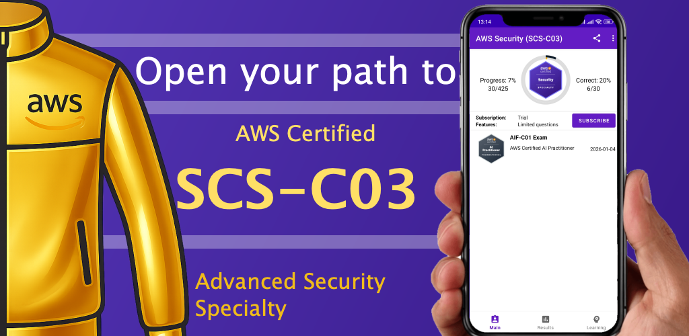

This application helps you prepare for the **AWS Certified Security Specialty (SCS-C03)** certification exam.

The app contains practice questions designed to simulate the real exam experience.

--

# Key Features

• Practice exam simulation  
• Study mode with explanations  
• Progress tracking  
• Question bookmarking  
• Offline access

---

# screens

## Motivation Quotes Splash Screen

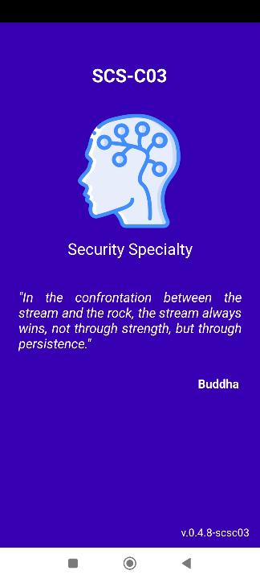

## Main Screen

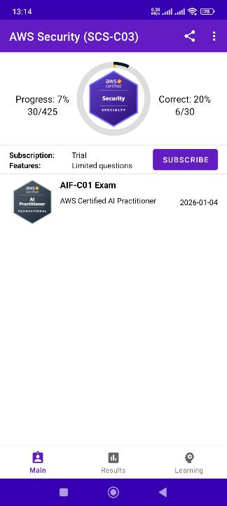

## Share application with community (QR Code)

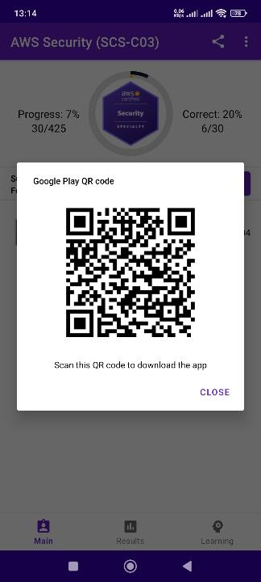

## Learning Section with all questions

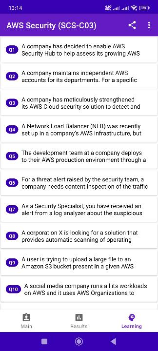

## Learning Mode with highlights of correct/wrong selection

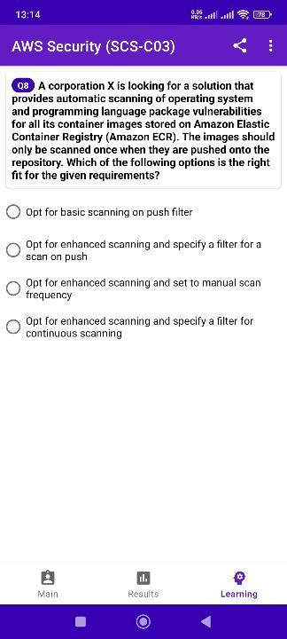

## Explanation Popup

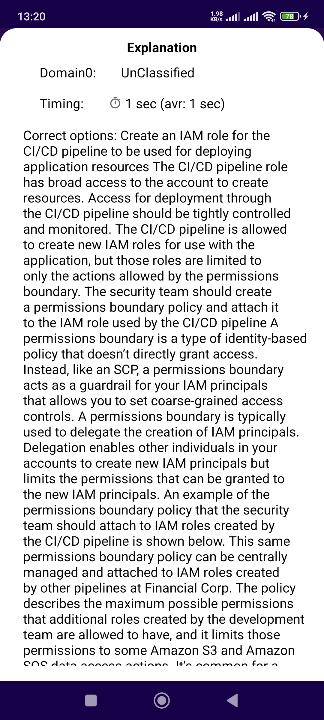

## Start Exam

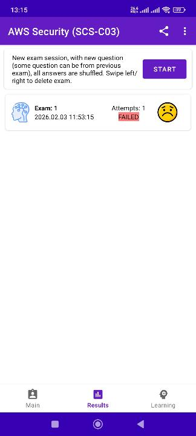

## Exam Mode

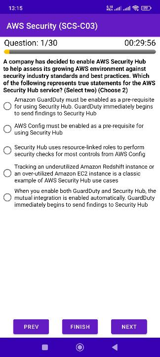

## Exam Results on Finish

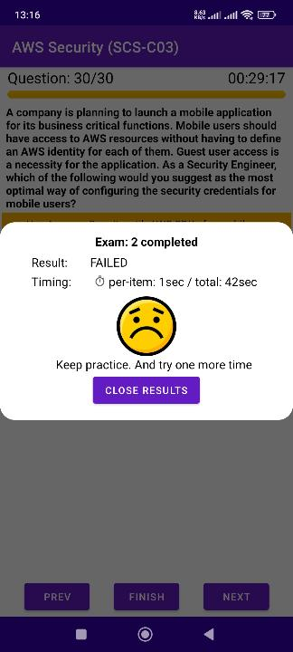

## Statistics of sessions

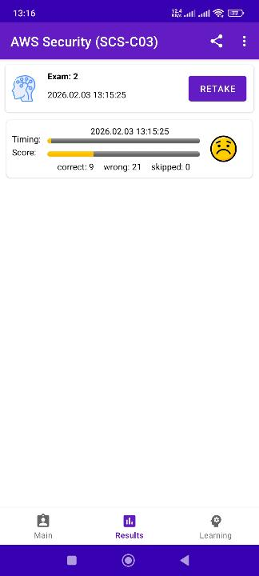

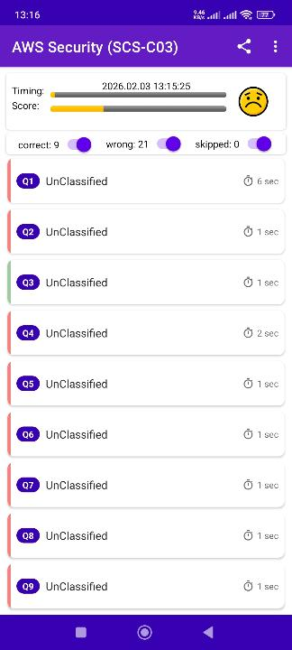

---

# Documentation

Common instructions:

- [How to Use the App](../shared/how-to-use.md)
